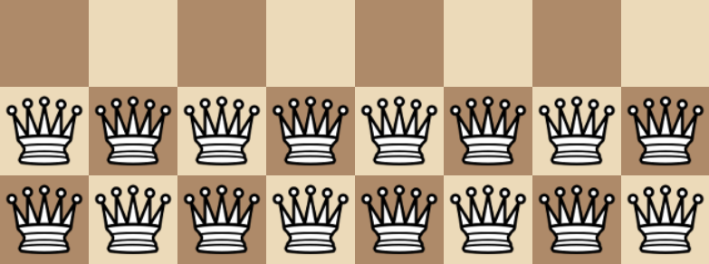

# *Chesses 4*

## [Play Online](https://www.pippinbarr.com/chesses4) (Desktop and Mobile)

---

## Description

*Check 1! Check 2! Did you get that check!? Go slow! Take the travelator! Do more with less! It's chess! Es!*

*Chesses 4* is another set of eight chess variations in the tradition of [Chesses](https://www.pippinbarr.com/chesses/info), [Chesses 2](https://www.pippinbarr.com/chesses2/info) and [Chesses 3](https://www.pippinbarr.com/chesses3/info). This one leaned more into complex mechanical stuff than I was expecting, but still had room for some simple ideas too. It was made with the crucial aid of [chess.js](https://github.com/jhlywa/chess.js) and [chessboard.js](https://www.chessboardjs.com/) as well as the somewhat antiquated assistance of [jQuery](https://jquery.com/) and [jQuery UI](https://jqueryui.com/) and [Howler.js](https://howlerjs.com/) came along for the ride too.

## Documentation

* Read the [Press kit](press/) for press information
* Read the [Process documentation](process/README.md) for process journal, to do list, and related work
* Read the [Commit History](https://github.com/pippinbarr/chesses4/commits/main) for step-by-step information about how the project was built
* Look at the [Code Repository](https://github.com/pippinbarr/chesses4) for source code etc.

## Attribution
- Popping sound in Less N Less is [Pop 4](https://freesound.org/people/quatricise/sounds/789793/) by [quatricise](https://freesound.org/people/quatricise/) on [freesound.org](https://freesound.org) 
- Ticking sound in Tick Tock is [Clock_Tick_Tock_Loop.wav](https://freesound.org/people/michael_grinnell/sounds/464402/) by [michael_grinnell](https://freesound.org/people/michael_grinnell/) on [freesound.org](https://freesound.org) 

## License

*Chesses 4* is an open source game licensed under a [MIT License](./LICENSE). You can obtain the source code from its [code repository](https://github.com/pippinbarr/chesses4) on GitHub.
