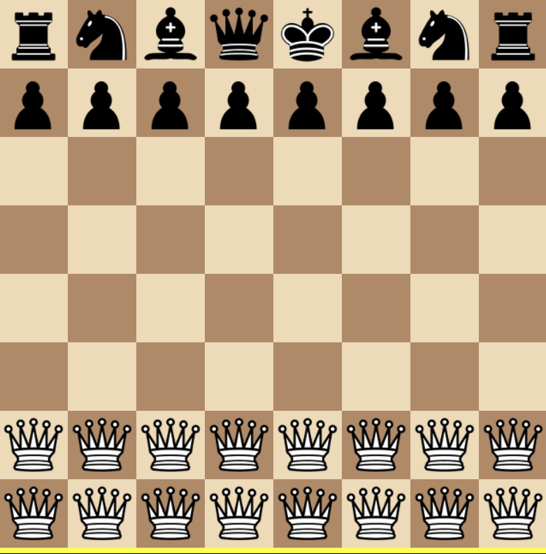

# Chesses 4 Press Kit

*Check 1! Check 2! Did you get that check!? Go slow! Take the travelator! Do more with less! It's chess! Es!*

#### [Play *Chesses 4*](https://pippinbarr.com/chesses4/) (Desktop and Mobile)

## The Basics

- Developer: [Pippin Barr](https://pippinbarr.com)
- Release: 30 June 2026
- Platform: Browser (Desktop and Mobile)
- Code repository: [https://github.com/pippinbarr/chesses4](https://github.com/pippinbarr/chesses4)
- Price: $0.00

## Who is this Pippin Barr guy?

Pippin is an experimental game developer who has made games about everything from [Eurovision](http://www.pippinbarr.com/2012/03/27/epic-sax-game/) to [performance art](http://www.pippinbarr.com/2011/09/14/the-artist-is-present/) to [dystopian post-work futures](http://www.pippinbarr.com/games/2017/07/03/it-is-as-if-you-were-doing-work.html). He's an Associate Professor in the [Department of Design and Computation Arts](http://www.concordia.ca/finearts/design.html) at [Concordia University](http://www.concordia.ca/) in Montréal. He is a member of the [Technoculture, Art, and Games (TAG)](http://tag.hexagram.ca/) Research Centre, which is part of the [Milieux Institute for Arts, Culture, and Technology](http://milieux.concordia.ca/).

## Description

*Chesses 4* is another set of eight chess variations in the tradition of [Chesses](https://www.pippinbarr.com/chesses/info), [Chesses 2](https://www.pippinbarr.com/chesses2/info) and [Chesses 3](https://www.pippinbarr.com/chesses3/info). This one leaned more into complex mechanical stuff than I was expecting, but still had room for some simple ideas too. 

## History

I started making *Chesses 4* because I was in a bit of a lull creative and I often find working on these smaller variation-based projects something that's "easy" to get underway and finished. I've also been writing a book specifically about the exercise in game design of taking an existing game and making simple variations. Part of writing the book was reading through the process documentation of past *Chesses* iterations and it made me miss working on that kind of stuff, so I started another one!

As such, *Chesses 4* is another data-point in the ultra-detailed process documentation approach called the [Method for Design Materialization (MDM)](http://materializing.design). So, if you want to, you can read a lot about the game's development by reading its [process documentation](https://pippinbarr.com/chesses4/process) and by going through its [commit history](https://github.com/pippinbarr/chesses4/commits/main).

## Technology
*Chesses 4* was made with the crucial aid of [chess.js](https://github.com/jhlywa/chess.js) and [chessboard.js](https://www.chessboardjs.com/) as well as the somewhat antiquated assistance of [jQuery](https://jquery.com/) and [jQuery UI](https://jqueryui.com/). And [Howler.js](https://howlerjs.com/) came along for the ride too!

## Features

- Slowing down
- The gift of time
- Cruising on the travelator
- Wild knights
- And more!

### Trailer

See animated GIFs.

## Images

  
Amazons Chess

  
Knights Chess

  
Less-N-Less Chess

  
Match-3 Chess

  
Slow Chess

## Press

Coming soon?

## Credits

* Pippin Barr: design and implementation
- Popping sound in Less N Less is [Pop 4](https://freesound.org/people/quatricise/sounds/789793/) by [quatricise](https://freesound.org/people/quatricise/) on [freesound.org](https://freesound.org) 
- Ticking sound in Tick Tock is [Clock_Tick_Tock_Loop.wav](https://freesound.org/people/michael_grinnell/sounds/464402/) by [michael_grinnell](https://freesound.org/people/michael_grinnell/) on [freesound.org](https://freesound.org) 

## Contact

* Email: [pippin.barr+press@proton.me](mailto:pippin.barr+press@proton.me)
* Website: [www.pippinbarr.com](http://www.pippinbarr.com/)
* Bluesky: [@pippinbarr](https://bsky.app/profile/pippinbarr.bsky.social)
* Instagram: [@pippinbarr](https://www.instagram.com/pippinbarr)
* Facebook: [Pippin Barr](http://www.facebook.com/pippin.barr)
